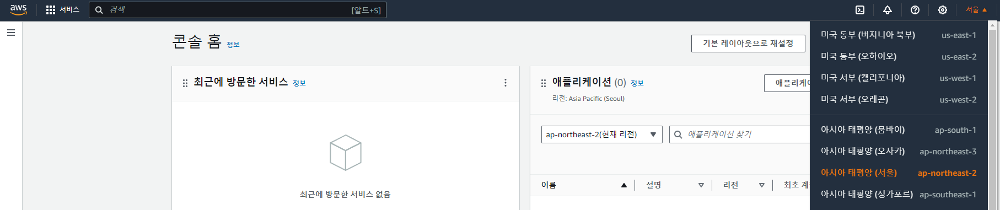
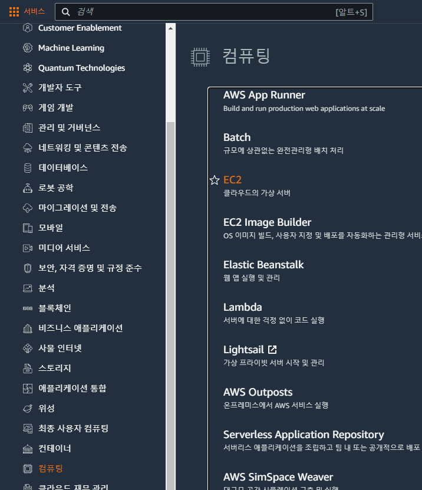
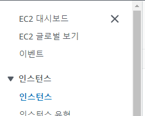
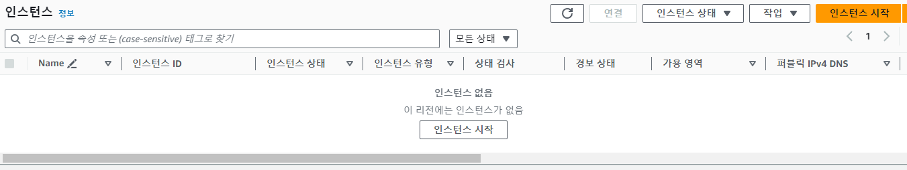
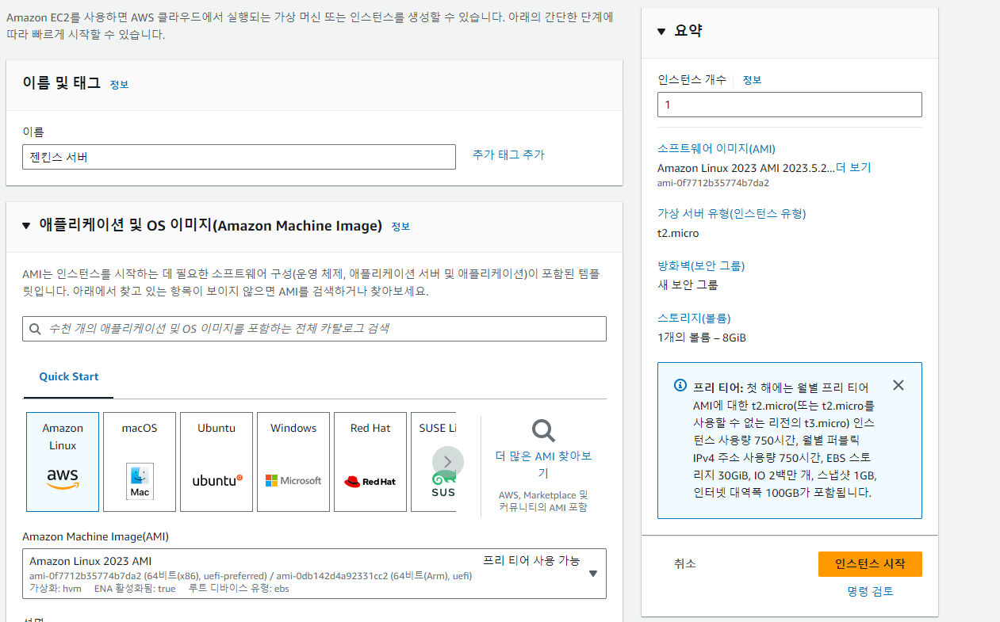
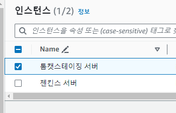
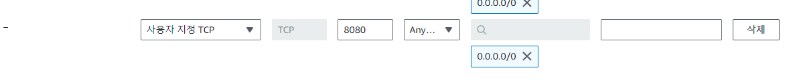
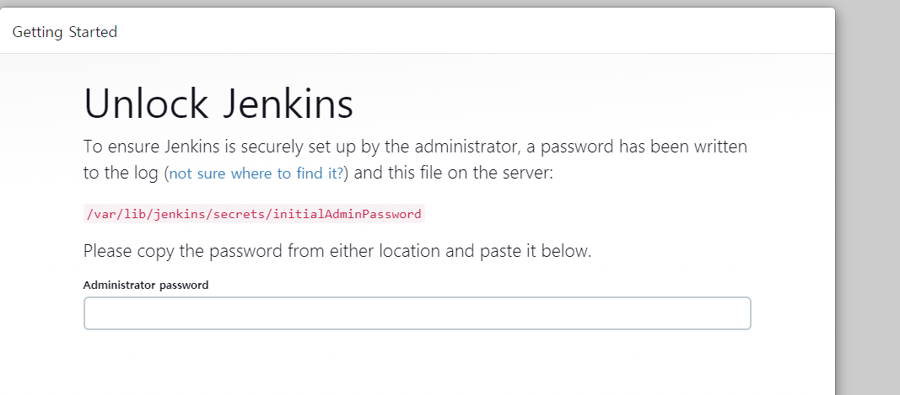

# DevOps_kitri ( 24.07.08 ~ 24.07.10 ) 


# 1일차
## 목차
- [DevOps\_kitri ( 24.07.08 ~ 24.07.10 )](#devops_kitri--240708--240710-)
- [1일차](#1일차)
  - [목차](#목차)
  - [SW 개발 방법론으로의 DevOps](#sw-개발-방법론으로의-devops)
  - [실습준비 사항](#실습준비-사항)
  - [DevOps 란](#devops-란)
  - [DevOps의 세가지 축](#devops의-세가지-축)
  - [DevOps 효과](#devops-효과)
  - [CI/CD](#cicd)
  - [CI](#ci)
  - [CD , 지속적 전달](#cd--지속적-전달)
  - [CD , 지속적 배포](#cd--지속적-배포)
  - [CI 서버](#ci-서버)
  - [스테이징 서버구조](#스테이징-서버구조)
  - [실습](#실습)


---
## SW 개발 방법론으로의 DevOps
- SDLC 방법론
    - waterfall
    - agile
    - DevOps
    - 기타(빅뱅, 스파이럴, 반복,V모델 )
- SDLC 방법론 베스트 프렉티스 
    - 소스통제
      - GIT,GITLAB,GITHUB ...
    - 지속적 통합
      - CI/CD
      - Jenkins,GitLab,CI...

## 실습준비 사항
-  AWS 계정 준비 필요(jhal1023@naver.com)
-  GITHUB 계정
-  DockerHub 계정 (jhal1023@naver.com)
   - [https://hub.docker.com/](https://hub.docker.com/)
## DevOps 란
- We do DevOps, We use DevOps tools
  - `개발과 운영이라는 단어의 축약형`
- 기존기업 문화와 다름
  - 사고방식, 프로세스 및 도구의 변화가 필요
- 주로
  - CD/CI
  - IaC(Infrastrcture as Code) 
## DevOps의 세가지 축
- 협업문화
  - 팀이 더이상 사일로 전문화로 구분되지 않음. 
  - 제품의 부가가치를 부여한다는 동일한 목표로 뭉침
- 프로세스
  - 애자일 방법론의 개발 프로세스를 따름.
  - CI( 개발 워크플로우)와 CD(배포 워크플로) 통합
  - DevOps 프로세스는 여러단계로 나뉨.
- 프로세스 진행 
  1. 계획 및 우선순위 부여
  2. 개발
  3. CI (continuous integration) and CD(delivery)
  4. Continuous Deployment
  5. Continuous Monitoring
    - 위 프로세스는 프로젝트에서 반복적으로 수행됨.
- 도구(tools)
  - 팀에서 사용하는 도구와제춤의 선택은 매우 중요
  - Dev와 Ops를 모두 포함하는 도구 사용
  - [https://roadmap.sh/devops](https://roadmap.sh/devops)
## DevOps 효과
- 팀의 더 나은 협업 및 의사소통
- 생산까지의 리드타임 단축
- IaC 로 인프라 비용 절감
- 자동화로 인한 애플리케이션 오류 감소
- 새로운 기능 개발에 집중 가능

## CI/CD 
- `지속적 통합`: CI (Continuous Integration)
- `지속적인 전달`: CD (Continuous Delivery)
- `지속적인 배포`: CD (Continuous Deployment)

## CI
- 자동화된 빌드(테스트 포함)
- CI 구현 -AA(Application Architect)
  - SCM -git, SVN,Perforce(P4)
  - 자동 빌드툴 - jenkins, gitlab CI, TeamCity, Azure Pipelinem, github Actions, Travis CI, AWS codeBuild
- 커밋 통합 -CI 프로세스의 시작
  - 애플리케이션 패키지 빌드 - 컴파일, 파일 변환등
  - 단위 테스트 수행
  - 정적코드 와 취약성 분석(옵션) - 시큐어 코딩
## CD , 지속적 전달
- 스테이징 환경으로 애플리케이션 배포(자동,수동 선택 가능)
  - 지속적 통합 과정이 완료되면 수행
  - CI에 의해 패키징된 결과물로 시작
  - unzip, 서버 시작/중지, 파일 복사, 설정 변경등
  - 기능 테스트와 인수 테스트 수행
- CD 구현 도구
  - 패키지 관리자 - Nexus,ProGet,Artifactory
  - 구성 관리자
## CD , 지속적 배포
- 프로덕션 환경에 배포
  - 자동으로의 배포는 거의 구현되지 않음.
  - 프로덕션 문제 발생시 애플리케이션 복원 고려
  - 블루-그린 프로덕션 환경 구성 가능
## CI 서버
- EC2
  - 젠킨스
  - JDK17
  - 리눅스

## 스테이징 서버구조
- Tomcat? 뭐였징
- JDK17
- 리눅스
## 실습










젠킨스 서버에다가 JAVA17 설치
```shell
# 시스템 업데이트
sudo yum update -y

# Amazon Corretto 17 리포지토리 추가
sudo rpm --import https://yum.corretto.aws/corretto.key
sudo curl -L -o /etc/yum.repos.d/corretto.repo https://yum.corretto.aws/corretto.repo

# Amazon Corretto 17 설치
sudo yum install -y java-17-amazon-corretto

# Java 버전 확인
java -version
```

젠킨스 설치
```shell
# Jenkins 저장소 추가
sudo wget -O /etc/yum.repos.d/jenkins.repo https://pkg.jenkins.io/redhat-stable/jenkins.repo
sudo rpm --import https://pkg.jenkins.io/redhat-stable/jenkins.io.key

# Jenkins 설치
sudo yum install -y jenkins
```

젠킨스 실행
```shell
# Jenkins 서비스 시작
sudo systemctl start jenkins

# Jenkins 서비스 자동 시작 설정
sudo systemctl enable jenkins
```

보안- 방화벽



톰캣 스테이징 서버 
```shell
# 시스템 업데이트
sudo yum update -y

# Amazon Corretto 17 리포지토리 추가
sudo rpm --import https://yum.corretto.aws/corretto.key
sudo curl -L -o /etc/yum.repos.d/corretto.repo https://yum.corretto.aws/corretto.repo

# Amazon Corretto 17 설치
sudo yum install -y java-17-amazon-corretto

# Java 버전 확인
java -version

```

톰캣 설치
```shell
# Tomcat 다운로드
cd /tmp
wget https://downloads.apache.org/tomcat/tomcat-9/v9.0.90/bin/apache-tomcat-9.0.90.tar.gz

# Tomcat 디렉토리에 압축 해제
sudo mkdir /opt/tomcat
sudo tar xzvf apache-tomcat-9.0.90.tar.gz -C /opt/tomcat --strip-components=1

# Tomcat 실행 권한 설정
sudo sh -c 'chmod +x /opt/tomcat/bin/*.sh'
```
